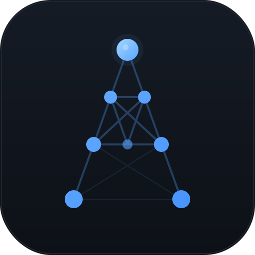

<p align="center">
  
</p>

<h1 align="center">Anamnesis</h1>

<p align="center">
  <strong>A spaced-repetition study tool that parses LaTeX lecture notes into an interactive knowledge graph with adaptive review scheduling.</strong>
</p>

<p align="center">
  <em>Anamnesis</em> (Greek: <em>ἀνάμνησις</em>, "recollection") is built for exam revision of theorem-heavy university courses. Drop your <code>.tex</code> files into the browser and Anamnesis extracts every definition, theorem, lemma, proof, and example into a browsable, quizzable, reviewable knowledge base — no command-line steps required.
</p>

## Features

- **Drag-and-Drop Onboarding** — Drop `.tex` files into the browser to create a course; parsing, graph building, and dependency inference all happen automatically
- **LaTeX Parsing** — Extracts theorem-like environments (`\begin{theorem}`, `\begin{definition}`, etc.), resolves `\ref`/`\eqref` cross-references, and renders math via KaTeX
- **Knowledge Graph** — Infers concept dependencies (which theorems depend on which definitions) and visualizes them as an interactive D3.js force graph
- **Adaptive RL Question Selection** — Thompson Sampling learns your weak points from every review, prioritizing questions you're most likely to get wrong
- **Spaced Repetition** — FSRS-inspired scheduling tracks per-concept difficulty and stability, prioritizing review of items closest to being forgotten
- **Diagnostic Assessment** — Quick self-rating of the most important concepts to identify knowledge gaps
- **Guided Learning Paths** — Topologically-sorted study plans: learn prerequisites before target theorems
- **Six Quiz Modes** — Definition recall, theorem statement, proof reconstruction, reverse identification, fill-in-the-blank, and smart review
- **Multi-Course Support** — Create, switch between, and manage multiple courses with isolated progress tracking
- **Full State Persistence** — All UI state (current page, quiz progress, expanded sections) survives page reloads
- **Desktop App** — Standalone native window via pywebview; builds to a single ~16 MB executable with PyInstaller

## Download (Desktop App)

Anamnesis is available as a standalone desktop application — no Python installation required.

| Platform | Download | Size |
|----------|----------|------|
| Windows | `Anamnesis.exe` | ~16 MB |
| macOS | `Anamnesis.app` | ~16 MB |

Just download and run. The app opens in a native window with full offline support. Your data is stored in the platform-standard location:

| Platform | Data Location |
|----------|--------------|
| Windows | `%APPDATA%\Local\Anamnesis\data\` |
| macOS | `~/Library/Application Support/Anamnesis/data/` |

## Quick Start (Development)

### Prerequisites

- Python 3.11+
- pip

### Installation

```bash
git clone https://github.com/shuhan-wang1/Anamnesis.git
cd Anamnesis
pip install -r requirements.txt
```

### Run (Development Server)

```bash
python server/app.py
```

Open `http://localhost:5000` in your browser. On first launch you will see the welcome screen — drag and drop your `.tex` files (or use the file/folder picker) to create your first course. Anamnesis handles all parsing, dependency analysis, and graph construction automatically.

### Run (Desktop Mode)

To run as a native desktop window during development (without building an executable):

```bash
pip install -r requirements-desktop.txt
python scripts/vendor_assets.py   # download KaTeX & D3.js locally (one-time)
python desktop.py
```

> **Existing data?** If you have legacy data from an earlier version (files in `input/` or `data/`), Anamnesis auto-migrates them into the course structure on startup — no manual migration needed.

## Architecture

```
Anamnesis/
├── config.py                 # Global configuration (dual dev/desktop mode)
├── desktop.py                # Desktop entry point (pywebview + Flask)
├── build_desktop.py          # Build automation for PyInstaller
├── anamnesis.spec            # PyInstaller spec (Windows, macOS, Linux)
├── requirements.txt          # Base dependencies
├── requirements-desktop.txt  # Desktop-specific dependencies
│
├── assets/                   # App icons
│   ├── icon.ico              # Windows executable icon
│   └── icon.png              # Source icon (512×512)
│
├── parser/                   # LaTeX → structured nodes
│   ├── latex_parser.py       # Environment extraction (\begin{theorem}...)
│   ├── katex_converter.py    # LaTeX → HTML+KaTeX conversion
│   ├── macro_expander.py     # \newcommand resolution
│   ├── ref_resolver.py       # \ref{} cross-reference resolution
│   └── section_tracker.py    # Section numbering (Theorem 2.5, etc.)
│
├── inference/                # Dependency analysis
│   ├── concept_analyzer.py   # Content-based edge detection
│   ├── dependency_inferrer.py # LLM-assisted inference (optional)
│   ├── graph_merger.py       # Edge deduplication & graph building
│   └── prompt_templates.py
│
├── scripts/                  # CLI utilities
│   ├── parse_all.py          # .tex → parsed_nodes.json
│   ├── build_graph.py        # nodes → knowledge_graph.json
│   ├── infer_deps.py         # Claude API → inferred_edges.json
│   ├── name_nodes.py         # Auto-naming via Claude API
│   └── vendor_assets.py      # Download KaTeX + D3.js for offline use
│
├── server/                   # Flask backend
│   ├── app.py                # Entry point + startup() + static serving
│   ├── state.py              # Course-aware global state
│   ├── course_manager.py     # Course CRUD + pipeline orchestration
│   └── routes/
│       ├── graph_api.py      # GET /api/graph, /api/node/:id
│       ├── progress_api.py   # Progress tracking + reset
│       ├── dashboard_api.py  # Readiness statistics
│       ├── learning_api.py   # Study plans + learning paths
│       ├── quiz_api.py       # Quiz generation (6 types)
│       ├── diagnostic_api.py # Diagnostic assessment
│       ├── spaced_repetition.py # SR + RL engine (FSRS + Thompson Sampling)
│       └── course_api.py     # Course management endpoints
│
└── frontend/                 # Vanilla JS SPA
    ├── index.html
    ├── logo.svg              # Project logo / favicon
    ├── css/main.css          # GitHub dark theme
    ├── vendor/               # Bundled offline assets
    │   ├── katex/            # KaTeX CSS, JS, and 60 font files
    │   └── d3/               # D3.js v7
    └── js/
        ├── api.js            # API client + Session manager
        ├── app.js            # SPA router + onboarding logic
        ├── katex_setup.js    # Math rendering config
        └── components/
            ├── welcome.js    # First-run onboarding with drag-and-drop
            ├── dashboard.js  # Exam readiness overview + RL stats
            ├── diagnostic.js # Quick knowledge assessment
            ├── learning.js   # Study plans + focus paths
            ├── quiz.js       # Six quiz modes + predicted failure %
            ├── graph_viewer.js # D3 force-directed graph
            ├── browse.js     # All concepts browser
            ├── courses.js    # Course management
            └── node_card.js  # Reusable concept card
```

## Supported LaTeX Environments

Anamnesis recognizes these environments from your `.tex` files:

| Environment | Numbered | Notes |
|---|---|---|
| `theorem` | Yes | Proofs auto-folded into parent |
| `lemma` | Yes | |
| `proposition` | Yes | |
| `corollary` | Yes | |
| `definition` | Yes | |
| `example` | Yes | |
| `algorithm` | Yes | Pseudocode rendered |
| `exercise` | Yes | |
| `proof` | No | Linked to preceding theorem |
| `remark` | No | |
| `note` | No | |

## Tips for Best Results

For the parser to work well, your `.tex` notes should:

- Use standard `\begin{theorem}...\end{theorem}` environments
- Include `\label{thm:name}` for cross-referencing
- Use `\ref{thm:name}` when one theorem depends on another
- Give titles to important results: `\begin{theorem}[Perceptron Bound]`
- Use `\begin{proof}` immediately after the theorem it proves

See the **LaTeX Revision Prompt** section below for a Claude prompt that can clean up your notes for optimal parsing.

## LaTeX Revision Prompt

If your `.tex` notes have inconsistent formatting, missing cross-references, or unnamed theorems, you can use Claude to revise them before uploading. See [LATEX_REVISION_PROMPT.md](LATEX_REVISION_PROMPT.md) for a ready-to-use prompt.

## Building from Source

To build a standalone executable yourself:

```bash
# Install desktop dependencies
pip install -r requirements-desktop.txt

# Download KaTeX & D3.js for offline bundling (one-time)
python scripts/vendor_assets.py

# Build the executable
python build_desktop.py
```

Output:
- **Windows**: `dist/Anamnesis.exe` (~16 MB)
- **macOS**: `dist/Anamnesis.app` (~16 MB)

> **macOS icon**: To generate a proper `.icns` icon, run `iconutil` on the `assets/icon_1024.png` source image on a Mac. The build will use the default icon if `assets/icon.icns` is not present.

## Tech Stack

- **Backend**: Python 3.11+, Flask
- **Frontend**: Vanilla JS, KaTeX (math rendering), D3.js (graph visualization)
- **Desktop**: pywebview (native window), PyInstaller (bundling)
- **Spaced Repetition**: FSRS-inspired algorithm (difficulty, stability, retrievability)
- **Adaptive Learning**: Thompson Sampling (Beta distributions) for RL-based question selection
- **Optional**: Anthropic Claude API for dependency inference and auto-naming

## License

MIT
